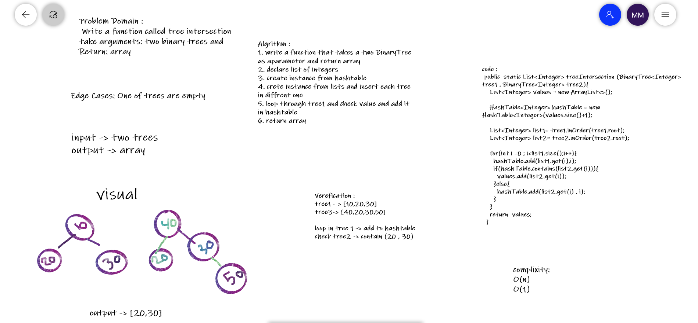
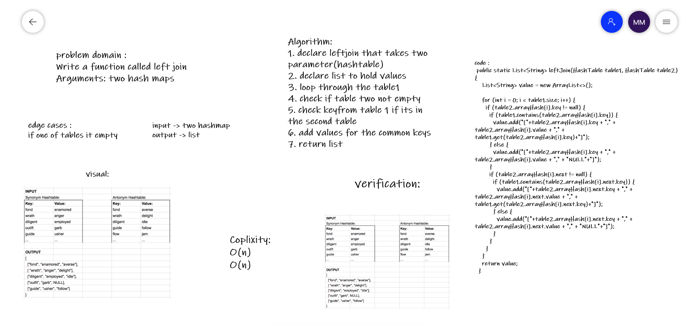

# Challenge Summary 30
<!-- Description of the challenge -->
- technique that is used to uniquely identify a specific object from a group of similar objects.

### API

1. add()
- Arguments: key, value
- Returns: nothing
- This method should hash the key, and add the key and value pair to the table, handling collisions as needed.

2. get()
- Arguments: key
- Returns: Value associated with that key in the table
- contains()

3. Arguments: key
- Returns: Boolean, indicating if the key exists in the table already.

4.  hash()
- Arguments: key
- Returns: Index in the collection for that key

# Challenge Summary 31
<!-- Description of the challenge -->
- technique that is used to uniquely identify a specific object from a group of similar objects.

## Whiteboard Process
<!-- Embedded whiteboard image -->

## Approach & Efficiency
<!-- What approach did you take? Why? What is the Big O space/time for this approach? -->
1. Time -> O(n)
2. Space -> O(n)

# Challenge Summary
<!-- Description of the challenge -->
- Find all values found to be in 2 binary trees

Write a function called tree intersection
- Arguments: two binary trees
- Return: array

## Whiteboard Process

## Approach & Efficiency
<!-- What approach did you take? Why? What is the Big O space/time for this approach? -->
- O(n) time
- O(1) space

# Hashmap LEFT JOIN
<!-- Short summary or background information -->

- Write a function called left join
- Arguments: two hash maps
1. The first parameter is a hashmap that has word strings as keys, and a synonym of the key as values.
2. The second parameter is a hashmap that has word strings as keys, and antonyms of the key as values.
- Return: The returned data structure that holds the results is up to you. It doesn’t need to exactly match the output below, so long as it achieves the LEFT JOIN logic

## Challenge
<!-- Description of the challenge -->

## Approach & Efficiency
- O(n) time 
- O(n) space
