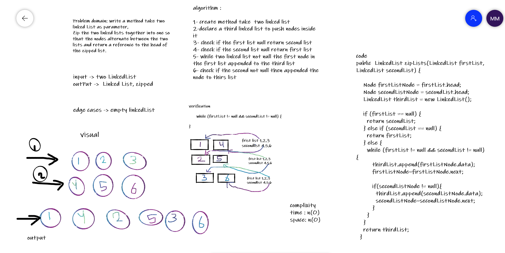

# challenge summary
 write a method take two linked List as parameter,
Zip the two linked lists together into one so that the nodes alternate between the two lists and return a reference to the head of the zipped list.

### whiteBoard 

### solution
code 
public  LinkedList zipLists(LinkedList firstList, LinkedList secondList) {

    Node firstListNode = firstList.head;
    Node secondListNode = secondList.head;
    LinkedList thirdList = new LinkedList();

    if (firstList == null) {
      return secondList;
    } else if (secondList == null) {
      return firstList;
    } else {
      while (firstList != null && secondList != null) {
         thirdList.append(firstListNode.data);
         firstListNode=firstListNode.next;

         if(secondListNode != null){
           thirdList.append(secondListNode.data);
           secondListNode=secondListNode.next;
         }
      }
    }
    return thirdList;
  }