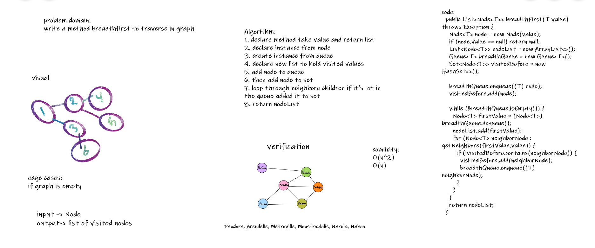
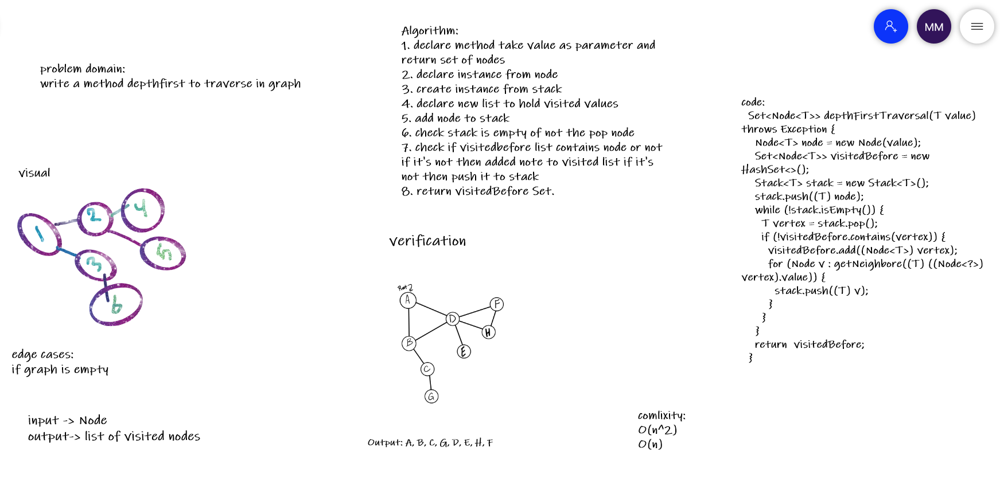

# Graphs
### Code Challenge: Class 35: Graph Implementation
<!-- Short summary or background information -->
- add node
1. Arguments: value
2. Returns: The added node
3. Add a node to the graph

- add edge
1. Arguments: 2 nodes to be connected by the edge, weight (optional)
2. Returns: nothing
3. Adds a new edge between two nodes in the graph
4. If specified, assign a weight to the edge
5. Both nodes should already be in the Graph

- get nodes
1. Arguments: none
2. Returns all of the nodes in the graph as a collection (set, list, or similar)

- get neighbors
1. Arguments: node
2. Returns a collection of edges connected to the given node
3. Include the weight of the connection in the returned collection

- size
1. Arguments: none
2. Returns the total number of nodes in the graph

# Graphs (graph-breadth-first)
<!-- Short summary or background information -->
- breadth first
- Arguments: Node
- Return: A collection of nodes in the order they were visited.
- Display the collection

## Challenge

## Approach & Efficiency
O(n^2) time
O(n) space

# Graphs (graph-breadth-first)
<!-- Short summary or background information -->
- depth first
- Arguments: Node (Starting point of search)
- Return: A collection of nodes in their pre-order depth-first traversal order
- Display the collection

## Challenge

## Approach & Efficiency
O(n^2) time
O(n) space

