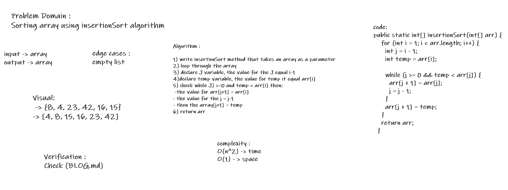
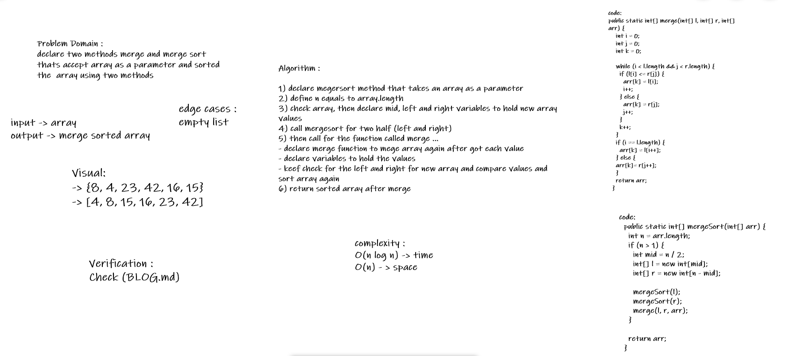
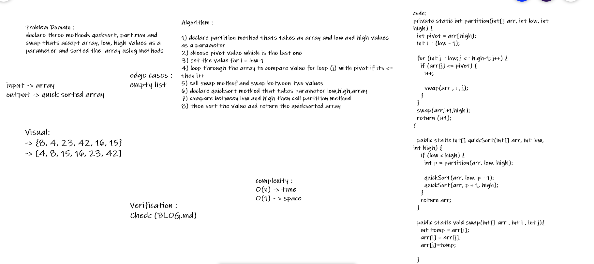

# Challenge Summary 26
# Challenge Summary
<!-- Description of the challenge -->
- Insertion sort is a simple sorting algorithm that builds the final sorted array (or list) one item at a time

## Whiteboard Process
<!-- Embedded whiteboard image -->

## Approach & Efficiency
<!-- What approach did you take? Why? What is the Big O space/time for this approach? -->
1. Time -> O(n^2)
2. Space -> O(n)

## Solution
<!-- Show how to run your code, and examples of it in action -->
* check BLOG.md

# Challenge Summary 27
<!-- Description of the challenge -->
- declare two methods merge and merge sort thats accept array as a parameter and sorted the  array using two methods

## Whiteboard Process
<!-- Embedded whiteboard image -->

## Approach & Efficiency
<!-- What approach did you take? Why? What is the Big O space/time for this approach? -->
1. Time -> O( n log n )
2. Space -> O(n)

## Solution
<!-- Show how to run your code, and examples of it in action -->
* check BLOG.md

# Challenge Summary 27
<!-- Description of the challenge -->
- declare three methods quicksort and swap and partition accept array as a parameter and value for low and high values  and sorted the  array using the methods

## Whiteboard Process
<!-- Embedded whiteboard image -->

## Approach & Efficiency
<!-- What approach did you take? Why? What is the Big O space/time for this approach? -->
1. Time -> O( n )
2. Space -> O(1)

## Solution
<!-- Show how to run your code, and examples of it in action -->
* check BLOG.md

