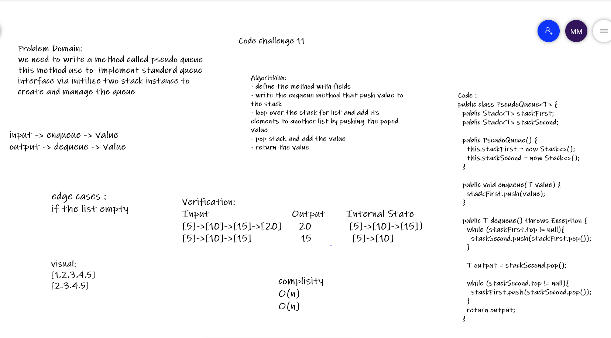
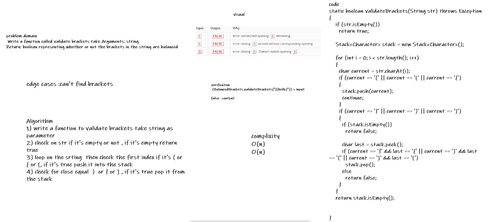

## Stacks and Queues
### Challenge Type: New Implementation for stack and queue

* A stack is a data structure that consists of Nodes. Each Node references the next Node in the stack, but does not reference its previous. follow these concepts:

- FILO:First In Last Out.
- LIFO: Last In First Out.

* A Queue is a linear structure which follows a particular order in which the operations are performed. follow these concepts:

- FIFO First In First Out.
- LILO Last In Last Out.

* Challenge

- Stack
Create a Stack class that has a top property. It creates an empty Stack when instantiated. This object should be aware of a default empty value assigned to top when the stack is created.

- Queue
Create a Queue class that has a front property. It creates an empty Queue when instantiated. This object should be aware of a default empty value assigned to front when the queue is created.

* Approach & Efficiency
- Space: O(1).
- Time: O(1).

* API
Stack Methods:

- push():adds a new node with that value to the top of the stack with an O(1) Time performance.

- pop(): Removes the node from the top of the stack Should raise exception when called on empty stack peek, Returns the value from node from the top of the stack.

- peek(): Returns Value of the node located at the top of the stack. Should raise exception when called on empty stack.

- is empty(): Returns Boolean indicating whether or not the stack is empty.

* Queue Methods:

- enqueue():adds a new node with that value to the back of the queue with an O(1) Time performance.

- dequeue(): Removes the node from the front of the queue. Should raise exception when called on empty queue. Returns: the value from node from the front of the queue.

- peek(): Returns Value of the node located at the top of the queue. Should raise exception when called on empty queue.

- is empty(): Returns Boolean indicating whether or not the queue is empty.

### challenge 11
- Create a new class called pseudo queue. this PseudoQueue class will implement our standard queue interface. Internally, utilize 2 Stack instances to create and manage the queue.

* enqueue:
1. Inserts value 
2. use FIFO  (first-in-first-out approach).
* dequeue:
1. Extracts a value
2. use FIFO  (first-in-first-out approach).

* Whiteboard Process

### challenge 12 
- Challenge Animal Shelter

- Create a class called AnimalShelter which holds only dogs and cats, using a first-in, first-out approach.

* enqueue() : animal can be either a dog or a cat object., using a first-in, first-out approach.

* dequeue() : Extracts a either a dog or a cat, based on preference, using a first-in, first-out approach. If pref is not "dog" or "cat" then return null.

* Whiteboard Process

### chalenge 13
* validateBrackets > validate brackets and return whether or not the brackets in the string are balanced.

- Challenge Animal Shelter
Write a function called validate brackets takes a String as an Arguments representing whether or not the brackets in the string are balanced, There are 3 types of brackets:

* Round Brackets : ()
* Square Brackets : []
* Curly Brackets : {}
* Whiteboard Process

* Whiteboard Process

