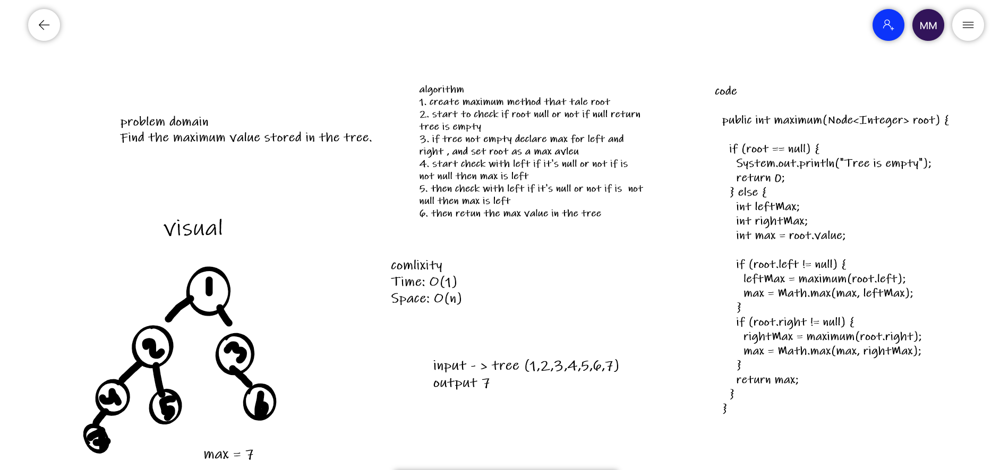
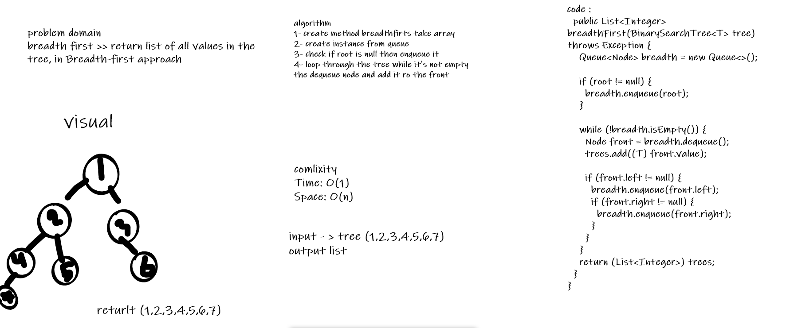
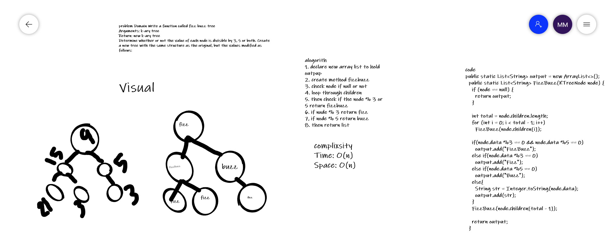

Challenge 15 
 Implement Binary Tree class with (pre order, in order and post order) methods, and Binary Search Tree with (add and contains) methods.

Challenge 16
Create a method to find the Maximum Value in a Binary Tree

Challenge 17 
Create a method to do Breadth-first Traversal.

Challenge 18
 Conduct “FizzBuzz” on a k-ary tree while traversing through it to create a new tree.

Complixity
Challenge 15
Time: O(1)
Space: O(n)

Challenge 16
Time: O(1)
Space: O(n)

Challenge 17
Time: O(n)
Space: O(n)

Challenge 18
Time: O(n)
Space: O(n)

challenge 16:

challenge 17 : 

challenge 18 :

